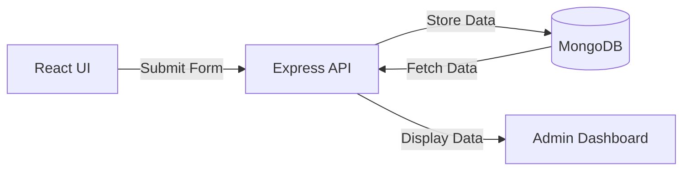

# 🚀 Customer Feedback Portal (MERN Stack)

## 📌 Project Overview
The Customer Feedback Portal is a full-stack web application built using the MERN stack (MongoDB, Express.js, React.js, Node.js).  
It allows users to submit feedback and enables administrators to view and manage responses efficiently.

---

## 🧠 Problem Statement
Many businesses struggle to collect and manage customer feedback effectively.  
This project provides a centralized platform to:
- Collect feedback from users
- Store it securely
- Allow easy access for analysis

---

## ✨ Features

### 👤 User Features
- Submit feedback
- Simple and user-friendly interface

### 🛠️ Admin Features
- View all feedback
- Manage responses

### ⚙️ System Features
- REST API integration
- MongoDB database storage
- Scalable architecture

---

## 🏗️ Tech Stack

### Frontend
- React.js
- HTML5
- CSS3
- JavaScript

### Backend
- Node.js
- Express.js

### Database
- MongoDB

---

## 📂 Project Structure

```text
customer-feedback-portal/
├── backend/                # Node.js + Express server
│   ├── routes/             # API endpoint definitions
│   ├── models/             # Database schemas 
│   └── controllers/        # Logic for handling requests
├── frontend/               # React application
│   ├── src/                # Main React source code
│   ├── components/         # Reusable UI components
│   └── pages/              # Full page views/routes
└── README.md               # Project documentation
```


---

## ⚙️ Installation & Setup

### 1️⃣ Clone the Repository
git clone https://github.com/AP24110010283/customer-feedback-portal.git

cd customer-feedback-portal

---

### 2️⃣ Backend Setup
cd backend
npm install
npm start

---

### 3️⃣ Frontend Setup
cd frontend
npm install
npm run dev

---

## 🔐 Environment Variables

Create a `.env` file in the backend folder:
MONGO_URI=your_mongodb_connection_string
PORT=5000


---

## 🚀 Working Flow

1. User submits feedback through frontend  
2. Frontend sends request to backend API  
3. Backend processes request  
4. Data is stored in MongoDB  
5. Admin views feedback  

---

## 🎯 Future Enhancements
- User authentication (Login/Register)
- Data visualization dashboards
- Email notifications
- AI-based sentiment analysis

---

## 👨‍💻 Author
Mukesh Krishna  
B.Tech - AI & ML  

---

## 📜 License
This project is created for academic purposes.

---

## ⭐ Acknowledgment
Thanks to all resources and mentors who supported this project.

## 🔄 Application Flow

1.  **User Access**: User opens the frontend (React UI).
2.  **Feedback Submission**: User fills out and submits the feedback form.
3.  **API Communication**: The React application sends an HTTP request to the backend (Express API).
4.  **Data Persistence**: The backend validates the logic and stores the feedback data in **MongoDB**.
5.  **Admin Review**: The Admin dashboard fetches the stored data from the API and displays it for review.

### Flow Diagram


## 🚀 Future Enhancements

*   **🔐 User Authentication**: Secure Login/Register functionality for users and admins.
*   **📊 Data Visualization**: Integrated charts and analytics to track feedback trends.
*   **📧 Email Notifications**: Automatic alerts for new feedback submissions.
*   **🤖 AI-based Sentiment Analysis**: Automatically categorizing feedback as positive, neutral, or negative.
*   **🌐 Cloud Deployment**: Hosting the application on platforms like AWS, Heroku, or Vercel.

## 🧪 Testing

*   **API Testing**: Verified endpoints using **Postman**.
*   **Manual UI Testing**: Ensuring responsive design and smooth user interactions.
*   **Error Handling**: Implemented robust validation and error messaging on both client and server.

## 📚 Learning Outcomes

*   **MERN Stack**: Gained hands-on experience with MongoDB, Express, React, and Node.js.
*   **REST APIs**: Built and consumed structured API endpoints.
*   **Full-Stack Integration**: Mastered the connection between frontend state and backend databases.
*   **Database Management**: Designed schemas and handled CRUD operations effectively.

## 👨‍💻 Author

**Mukesh Krishna**  
*B.Tech – Artificial Intelligence & Machine Learning*

## 📜 License

This project is developed for academic purposes only.

## 🙌 Acknowledgment

Special thanks to:
*   Faculty and mentors
*   Online learning resources
*   The Open-source community

